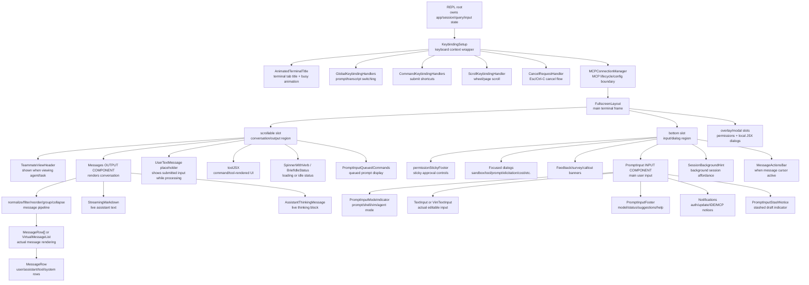
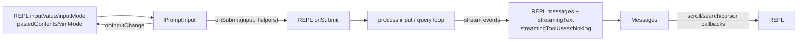

# REPL Layout Graph

This note summarizes the child React component layout of `restored-src/src/screens/REPL.tsx`, with emphasis on the output and input boundaries.

## Main Layout

## Key Data Flow

## Output Boundary: `Messages`

`Messages` is the main output component. In normal prompt mode it is rendered inside `FullscreenLayout.scrollable`.

Important props from `REPL`:

| Prop | Purpose |
| --- | --- |
| `messages={displayedMessages}` | Visible conversation. Usually `messages` or `deferredMessages`; switches to viewed agent task messages when zoomed into an agent. |
| `tools`, `commands` | Tool and slash-command metadata used to render tool calls/results. |
| `verbose` | Controls expanded rendering. |
| `toolJSX` | Active tool/local command UI state; also affects animation. |
| `toolUseConfirmQueue` | Permission state affecting message animation/static rendering. |
| `inProgressToolUseIDs` | IDs of currently running tools; agent view may use teammate-specific IDs. |
| `conversationId` | Included in row keys to force remount after compaction/session resets. |
| `screen` | `'prompt'` or `'transcript'`; changes filtering and render behavior. |
| `streamingToolUses` | Tool-use deltas not yet committed into messages. |
| `streamingText` | Live assistant text preview while loading. |
| `isLoading` | Loading state for row rendering and progress behavior. |
| `isBriefOnly` | Filters output to brief user-facing content. |
| `unseenDivider` | Fullscreen "N new messages" divider state. |
| `scrollRef`, `trackStickyPrompt` | Enables virtualized fullscreen scrolling and sticky prompt tracking. |
| `cursor`, `setCursor`, `cursorNavRef` | Message action selection/navigation state. |

Internal rendering pipeline:

1. Normalize messages.
2. Add synthetic streaming tool-use messages.
3. Filter, reorder, group, and collapse messages.
4. Compute `renderableMessages`.
5. Render either `VirtualMessageList` or `MessageRow[]`.
6. Append live `StreamingMarkdown` and `AssistantThinkingMessage`.

## Input Boundary: `PromptInput`

`PromptInput` is the main input component. It is rendered in `FullscreenLayout.bottom`, and hidden while blocking dialogs, local JSX overlays, exit flow, disabled mode, or message-action cursor mode are active.

Important props from `REPL`:

| Prop | Purpose |
| --- | --- |
| `input={inputValue}` | REPL-owned current prompt text. |
| `onInputChange={setInputValue}` | Updates input, typing-active suppression, and fullscreen repin behavior. |
| `mode={inputMode}`, `onModeChange={setInputMode}` | Prompt mode state. |
| `onSubmit={onSubmit}` | Main submit path into prompt processing/query execution. |
| `onAgentSubmit={onAgentSubmit}` | Submit path when typing into a viewed/active agent task. |
| `commands` | Slash command definitions for suggestions and execution. |
| `agents={agentDefinitions.activeAgents}` | Agent suggestions/routing. |
| `messages` | Conversation context for history/footer/status behavior. |
| `toolPermissionContext`, `setToolPermissionContext` | Permission mode/rule controls. |
| `getToolUseContext` | Factory for command/dialog/tool contexts. |
| `mcpClients` | MCP state for footer/status, at-mentions, bridge-related UI. |
| `pastedContents`, `setPastedContents` | Tracks pasted text/images by ref id. |
| `vimMode`, `setVimMode` | Vim input state. |
| `stashedPrompt`, `setStashedPrompt` | Prompt stash/restore state. |
| `showBashesDialog`, `setShowBashesDialog` | Background task/dialog control. |
| `isSearchingHistory`, `setIsSearchingHistory` | History search state. |
| `helpOpen`, `setHelpOpen` | Help overlay state. |
| `insertTextRef`, `voiceInterimRange` | Voice-mode insertion/control when enabled. |
| `apiKeyStatus`, `autoUpdaterResult`, `onAutoUpdaterResult` | Footer/notification status. |

Internal layout:

1. `PromptInputQueuedCommands`
2. suppressed-dialog notice
3. `PromptInputStashNotice`
4. `PromptInputModeIndicator`
5. `TextInput` or `VimTextInput`
6. `PromptInputFooter`
7. `Notifications`

## Transcript Mode Variant

Transcript mode returns early from `REPL` and renders another `Messages` instance with transcript-specific props:

- `verbose={true}`
- `toolJSX={null}`
- `toolUseConfirmQueue={[]}`
- `screen="transcript"`
- `hidePastThinking={true}`
- transcript search props: `jumpRef`, `onSearchMatchesChange`, `scanElement`, `setPositions`
- optional virtual scroll via `scrollRef`

The transcript bottom slot switches between `TranscriptSearchBar` and `TranscriptModeFooter`.
