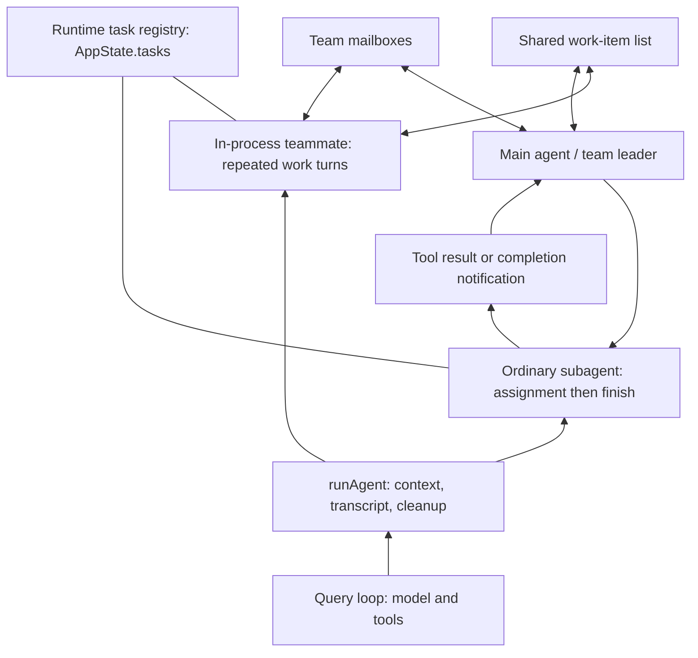
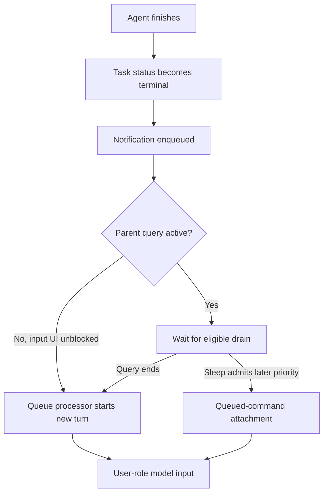
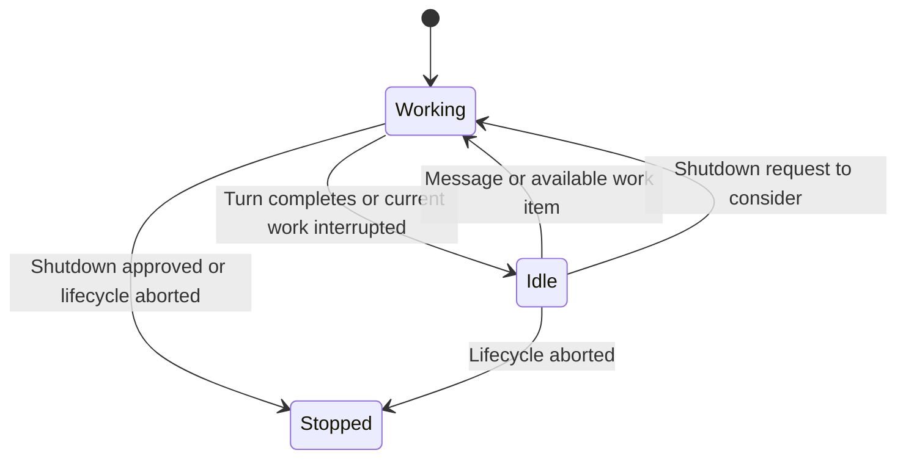

# Tasks, subagents, background agents, and teams

This guide consolidates our source-reading discussion of the recovered Claude Code 2.1.88 snapshot. It assumes familiarity with the model/tool query loop and explains the structures around it: delegation, execution bookkeeping, result delivery, and team coordination.

This is an unofficial recovered repository, not an upstream source checkout. Findings describe the implementations present here. Feature-gated paths are not necessarily enabled in a particular released build. Editor-only `.d.ts` stubs are not evidence of runtime behavior. The observations below come from static reading, not an end-to-end execution test.

Code blocks labelled **excerpt** retain the selected source code, sometimes omitting unrelated fields or branches. Blocks labelled **simplified** explain structure or control flow and are not verbatim source. Source links point to the recovered implementation; search for the named symbol within each file.

## 1. The objects to keep separate

| Concept | Meaning | Example |
| --- | --- | --- |
| Agent definition | Configuration reused by agent instances | `Explore`: instructions, model, allowed tools |
| Subagent instance | A separate conversation executing a delegated assignment | Investigate one login failure |
| Background subagent | A subagent whose caller does not wait for completion | Investigate while the parent works elsewhere |
| Runtime task record | Live bookkeeping for an execution | Status, output, cancellation, progress |
| Shared work item | A description of work, ownership, and dependencies | Task 3: write regression tests, owned by `tester` |
| Teammate | A persistent team participant that can repeatedly work and become idle | `tester@login-team` |
| Team | Membership, coordination resources, and leader association | Team config, inboxes, shared work list |

The word **task** is overloaded. `TaskOutput` and `TaskStop` operate on runtime executions. `TaskCreate`, `TaskList`, `TaskGet`, and `TaskUpdate` operate on work items. Completing a work item and terminating an agent are separate operations.



Execution, storage, and presentation are distinct:

```text
runAgent()/query()       performs work
AppState.tasks[id]      records execution state and control handles
agent transcript        preserves conversation on disk
team config             records membership
mailbox                 holds addressed teammate messages
shared work-item list   records assignments and dependencies
```

## 2. Agent definition versus agent instance

Source: [loadAgentsDir.ts](../restored-src/src/tools/AgentTool/loadAgentsDir.ts), `BaseAgentDefinition` and `AgentDefinition`.

Selected fields, **excerpt**:

```ts
export type BaseAgentDefinition = {
  agentType: string
  whenToUse: string
  tools?: string[]
  disallowedTools?: string[]
  // Other configuration omitted.
}

export type AgentDefinition =
  | BuiltInAgentDefinition
  | CustomAgentDefinition
  | PluginAgentDefinition
```

Definitions also carry model, permission, turn-limit, skill, hook, and other optional configuration. The variants provide `getSystemPrompt()`. A definition is not a running agent: it can be used to create multiple independent conversations.

For an ordinary instance, `runAgent()` resolves the model, assigns an agent ID, prepares messages and tools, chooses cancellation behavior, executes start hooks, invokes `query()`, records messages, and cleans up resources.

## 3. Ordinary subagent: inputs, loop, and result

### 3.1 The child gets its own conversation

Source: [AgentTool.tsx](../restored-src/src/tools/AgentTool/AgentTool.tsx), normal prompt construction and `runAgentParams`.

**Excerpt:**

```ts
promptMessages = [createUserMessage({ content: prompt })]
```

The parent assignment becomes the child's initial user message. The ordinary path does not automatically copy the parent's conversation:

```ts
forkContextMessages: isForkPath ? toolUseContext.messages : undefined,
```

Source: [runAgent.ts](../restored-src/src/tools/AgentTool/runAgent.ts), **excerpt**:

```ts
const contextMessages: Message[] = forkContextMessages
  ? filterIncompleteToolCalls(forkContextMessages)
  : []
const initialMessages: Message[] = [...contextMessages, ...promptMessages]

const agentReadFileState =
  forkContextMessages !== undefined
    ? cloneFileStateCache(toolUseContext.readFileState)
    : createFileStateCacheWithSizeLimit(READ_FILE_STATE_CACHE_SIZE)
```

A fresh ordinary child therefore needs a self-contained assignment. It also receives configured system instructions and applicable environment/project context; a fresh conversation does not mean no contextual information at all.

### 3.2 Context is separate; the filesystem usually is not

Selected context construction, **excerpt**:

```ts
const agentToolUseContext = createSubagentContext(toolUseContext, {
  options: agentOptions,
  agentId,
  agentType: agentDefinition.agentType,
  messages: initialMessages,
  readFileState: agentReadFileState,
  abortController: agentAbortController,
  getAppState: agentGetAppState,
  shareSetAppState: !isAsync,
  shareSetResponseLength: true,
  // Additional fields omitted.
})
```

`toolUseContext` is the parent context; `agentToolUseContext` is the child's. [createSubagentContext()](../restored-src/src/utils/forkedAgent.ts) creates separate mutable tracking state while retaining selected shared facilities. Background agents can have a no-op general `setAppState`, but `setAppStateForTasks` still reaches the root task registry.

Local subagents run in the same process. Conversation isolation is not process or filesystem isolation. Worktree isolation is explicit; without it, permitted edits affect the shared workspace. Tool filtering and permission checks remain relevant. Background agents normally avoid interactive permission prompts, with explicit exceptions such as permission bubbling.

### 3.3 `runAgent()` wraps the query loop

Source: [runAgent.ts](../restored-src/src/tools/AgentTool/runAgent.ts), **excerpt**:

```ts
for await (const message of query({
  messages: initialMessages,
  systemPrompt: agentSystemPrompt,
  userContext: resolvedUserContext,
  systemContext: resolvedSystemContext,
  canUseTool,
  toolUseContext: agentToolUseContext,
  querySource,
  maxTurns: maxTurns ?? agentDefinition.maxTurns,
})) {
  // Progress handling, transcript recording, and yielding omitted.
}
```

`runAgent()` is an `async function*`: its caller consumes a stream of messages. Recordable messages are appended to a sidechain transcript. Its `finally` releases agent-specific MCP connections, session hooks, and tracking state.

### 3.4 Why `agentIterator` is manually consumed

Source: [AgentTool.tsx](../restored-src/src/tools/AgentTool/AgentTool.tsx), `agentIterator` and `nextMessagePromise`.

**Simplified:**

```ts
const agentIterator = runAgent(runAgentParams)[Symbol.asyncIterator]()

while (true) {
  const nextMessagePromise = agentIterator.next()
  const event = await Promise.race([
    nextMessagePromise.then(result => ({ type: 'message', result })),
    backgroundPromise,
  ])

  if (event.type === 'background') {
    // Background transition path.
    break
  }
  if (event.result.done) break
  agentMessages.push(event.result.value)
}
```

The actual code handles an absent `backgroundPromise`, progress, errors, and cleanup. `.next()` returns a promise for `{ done, value }`. It advances the generator to another yield or termination, not necessarily one complete model turn. Calling an async generator creates the iterator; the first `next()` starts its body.

Manual consumption lets the caller react to backgrounding while waiting for another child message. `Promise.race()` does not cancel its losing promise.

**Snapshot caveat:** the background-transition branch calls `agentIterator.return(undefined)` with a one-second wait limit, then creates a new `runAgent({...runAgentParams, isAsync: true, ...})`. It does not hand the original iterator to a background consumer, nor explicitly supply accumulated `agentMessages` as the replacement conversation. Static reading therefore indicates restart-like behavior, not seamless iterator continuation. A pending `next()` is not forcibly interrupted by `return()`, and the timeout does not prove cleanup finished. Runtime consequences need a focused test; this guide does not claim they were reproduced.

### 3.5 Internal result becomes an API tool result

Source: [agentToolUtils.ts](../restored-src/src/tools/AgentTool/agentToolUtils.ts), `finalizeAgentTool`.

The finalizer extracts the last assistant text, falling back to earlier assistant text if necessary. It packages that content with identity and usage fields. The relevant result shape is **simplified**:

```ts
{
  agentId,
  agentType,
  content,             // Child answer text blocks
  totalDurationMs,
  totalTokens,
  totalToolUseCount,
  usage,
}
```

The foreground Agent tool returns `{ data: { status: 'completed', ... } }`. The generic executor calls this **excerpt**:

```ts
const mappedToolResultBlock = tool.mapToolResultToToolResultBlockParam(
  result.data,
  toolUseID,
)
```

Source: [toolExecution.ts](../restored-src/src/services/tools/toolExecution.ts).

The Agent mapper chooses the model-facing text. Completed one-shot built-ins can omit the agent-ID/usage trailer; other completed results can include it. Empty answers receive an explicit marker. The executor then wraps the block in a user-role message. **Illustrative API payload:**

```json
{
  "role": "user",
  "content": [{
    "type": "tool_result",
    "tool_use_id": "toolu_original_agent_call",
    "content": [{ "type": "text", "text": "The parser drops trailing empty fields." }]
  }]
}
```

The `tool_use_id` pairs the result with the parent's invocation; it is not the agent ID. The child transcript is not automatically merged into the parent's history. The parent receives the selected answer through its tool result.

## 4. Runtime task records: bookkeeping for executions

Source: [Task.ts](../restored-src/src/Task.ts), **excerpt**:

```ts
export type TaskStatus =
  | 'pending'
  | 'running'
  | 'completed'
  | 'failed'
  | 'killed'

export type TaskStateBase = {
  id: string
  type: TaskType
  status: TaskStatus
  description: string
  toolUseId?: string
  startTime: number
  endTime?: number
  totalPausedMs?: number
  outputFile: string
  outputOffset: number
  notified: boolean
}
```

`TaskType` distinguishes local shell commands, local agents, remote agents, teammates, and other supported executions. The separate `Task` interface in this file is a handler with a `kill()` method, not the stored record itself.

Source: [LocalAgentTask.tsx](../restored-src/src/tasks/LocalAgentTask/LocalAgentTask.tsx), selected fields, **excerpt**:

```ts
export type LocalAgentTaskState = TaskStateBase & {
  type: 'local_agent'
  agentId: string
  prompt: string
  selectedAgent?: AgentDefinition
  agentType: string
  model?: string
  abortController?: AbortController
  unregisterCleanup?: () => void
  error?: string
  result?: AgentToolResult
  progress?: AgentProgress
  retrieved: boolean
  messages?: Message[]
  lastReportedToolCount: number
  lastReportedTokenCount: number
  isBackgrounded: boolean
  pendingMessages: string[]
  retain: boolean
  diskLoaded: boolean
  evictAfter?: number
}

export type AgentProgress = {
  toolUseCount: number
  tokenCount: number
  lastActivity?: ToolActivity
  recentActivities?: ToolActivity[]
  summary?: string
}
```

| Field group | Purpose |
| --- | --- |
| `id`, `agentId`, `toolUseId` | Associate execution, agent, and original invocation |
| `status`, timestamps | Observe lifecycle and duration |
| `abortController`, cleanup callback | Control cancellation and shutdown cleanup |
| `progress`, `result`, `error` | Display activity and expose outcomes |
| `notified` | Suppress duplicate notification enqueue attempts |
| `pendingMessages` | Deliver follow-up text at tool-round boundaries |
| `retain`, `diskLoaded`, `evictAfter` | Manage viewed transcripts and memory retention |

Registration inserts a record into `AppState.tasks`; it does not execute the agent. For local agents, registration uses the agent ID as the runtime task ID. Foreground agents also register when background support is enabled, so UI controls can background them later.

[updateTaskState()](../restored-src/src/utils/task/framework.ts) replaces records immutably. Progress/completion handlers guard on `status === 'running'`, preventing late updates from overwriting a terminal state. Completion clears runtime handles and records an eviction deadline. Ordinary foreground completion removes its registration; background records remain available subject to notification and UI-retention conditions.

The record is not a durable serialized process: it contains controllers and functions. [sessionStorage.ts](../restored-src/src/utils/sessionStorage.ts), `getAgentTranscriptPath`, stores the agent conversation separately under the session's `subagents/agent-<id>.jsonl`, with accompanying metadata. Output paths can be symlinked to that transcript. Removing a live record does not inherently delete the conversation.

## 5. Background execution, follow-ups, and resumption

Background launch registers a `local_agent` record and starts execution without awaiting its entire lifetime. The initial Agent tool result says `async_launched`, supplies an agent ID/output path, and explains that completion will arrive later.

Cancellation selection in [runAgent.ts](../restored-src/src/tools/AgentTool/runAgent.ts), **excerpt**:

```ts
const agentAbortController = override?.abortController
  ? override.abortController
  : isAsync
    ? new AbortController()
    : toolUseContext.abortController
```

Explicit overrides win. Otherwise, asynchronous execution is independent of the parent's controller, while synchronous execution shares it. This allows a background agent to survive cancellation of the main turn. Explicit stop and application cleanup remain available.

[SendMessageTool.ts](../restored-src/src/tools/SendMessageTool/SendMessageTool.ts) first tries local-agent routing by registered name or valid agent ID before team routing:

| Target state | Action |
| --- | --- |
| Running local agent | Append text to its `pendingMessages` |
| Stopped local agent | Start background resumption with the follow-up |
| No live record, transcript available | Reconstruct and resume from disk |
| Team-name recipient | Use the teammate mailbox path |

[getAgentPendingMessageAttachments()](../restored-src/src/utils/attachments.ts) drains local-agent pending messages into model input at tool-round boundaries. This is distinct from the global notification queue and team inbox files.

[resumeAgentBackground()](../restored-src/src/tools/AgentTool/resumeAgent.ts) loads transcript and metadata, filters incomplete/orphaned message fragments, restores relevant context, and starts another execution. Resumption reconstructs a conversation; it does not revive a suspended JavaScript stack. Missing worktrees can cause fallback to the parent's working directory.

## 6. TaskOutput and completion notifications

### 6.1 Pulling a result versus receiving a notification

`TaskOutput` is a model-callable tool for observing a runtime task. Example:

```json
{ "task_id": "a123", "block": true, "timeout": 30000 }
```

`block: false` checks immediately. The blocking path polls task state every 100 ms until terminal status, timeout, disappearance, or cancellation. It does not consume the agent's iterator directly.

Source: [TaskOutputTool.tsx](../restored-src/src/tools/TaskOutputTool/TaskOutputTool.tsx), `waitForTaskCompletion`.

The background lifecycle deliberately orders events as follows:

```text
Store result and mark completed
    → TaskOutput can observe and return the result now
Prepare optional notification enrichment / inspect worktree
Enqueue completion notification
    → Parent consumes it when queue processing permits
```

Source: [runAsyncAgentLifecycle()](../restored-src/src/tools/AgentTool/agentToolUtils.ts). Completion must not wait on optional notification enrichment that may involve slow API or Git operations.

### 6.2 Notification queue structure

Selected fields from [textInputTypes.ts](../restored-src/src/types/textInputTypes.ts), **excerpt**:

```ts
export type QueuePriority = 'now' | 'next' | 'later'

export type QueuedCommand = {
  value: string | Array<ContentBlockParam>
  mode: PromptInputMode
  priority?: QueuePriority
  uuid?: UUID
  // Other input and provenance fields omitted.
  isMeta?: boolean
  origin?: MessageOrigin
  // Additional fields omitted.
  agentId?: AgentId
}
```

Here `agentId` is a destination, not necessarily the ID of the completed agent mentioned in the payload. Undefined means the main thread. The process-global queue is shared by in-process loops, so consumers filter destinations.

[enqueueAgentNotification()](../restored-src/src/tasks/LocalAgentTask/LocalAgentTask.tsx) checks and sets `task.notified`, then builds text such as:

```xml
<task-notification>
<task-id>a123</task-id>
<tool-use-id>toolu_original_call</tool-use-id>
<output-file>/path/to/output</output-file>
<status>completed</status>
<summary>Agent "Investigate parser" completed</summary>
<result>The parser drops trailing empty fields.</result>
</task-notification>
```

This is an illustrative payload; usage and worktree fields may also be included. It is enqueued with `mode: 'task-notification'` and default priority `later`.

Source: [messageQueueManager.ts](../restored-src/src/utils/messageQueueManager.ts), **excerpt**:

```ts
export function enqueuePendingNotification(command: QueuedCommand): void {
  commandQueue.push({ ...command, priority: command.priority ?? 'later' })
  notifySubscribers()
  logOperation(
    'enqueue',
    typeof command.value === 'string' ? command.value : undefined,
  )
}
```

### 6.3 Delivery timing



[useQueueProcessor()](../restored-src/src/hooks/useQueueProcessor.ts) subscribes to queue changes and query activity. When no query or blocking local UI is active, it invokes [processQueueIfReady()](../restored-src/src/utils/queueProcessor.ts). Same-mode commands can be batched, each becoming its own message. Human input defaults to `next`, ahead of `later` notifications.

Inside [query.ts](../restored-src/src/query.ts), the mid-turn drain uses this **excerpt**:

```ts
const queuedCommandsSnapshot = getCommandsByMaxPriority(
  sleepRan ? 'later' : 'next',
).filter(/* destination and command checks */)
```

Thus a normal agent-completion notification does not necessarily arrive at the next tool round: its default `later` priority normally waits for the turn to end, unless the Sleep path broadens the drain. This does not alter a model request already in flight.

The notification is a new **user-role text message**, not a second API `tool_result` for the original Agent call. Between turns it goes through submit processing; mid-turn it becomes an attachment and receives system-reminder wrapping. Internal origin marks it as `task-notification`. Headless/SDK processing in [print.ts](../restored-src/src/cli/print.ts) can additionally emit an SDK system event before feeding the result to the model.

`notified` and queue removal are application bookkeeping, not model acknowledgements. The queue is in memory, its operations are logged, and cancellation paths can clear entries. Do not infer durable exactly-once processing from these flags.

## 7. Teams: creation, member spawning, and deletion

### 7.1 Team configuration

Selected fields from [teamHelpers.ts](../restored-src/src/utils/swarm/teamHelpers.ts), **excerpt**:

```ts
export type TeamFile = {
  name: string
  description?: string
  createdAt: number
  leadAgentId: string
  leadSessionId?: string
  // Additional team fields omitted.
  members: Array<{
    agentId: string
    name: string
    agentType?: string
    model?: string
    prompt?: string
    // Additional member fields omitted.
    joinedAt: number
    tmuxPaneId: string
    cwd: string
    worktreePath?: string
    subscriptions: string[]
    backendType?: BackendType
    isActive?: boolean
    mode?: PermissionMode
  }>
}
```

The usual team resources are `~/.claude/teams/<team>/config.json`, inboxes below that team directory, and a shared task directory under `~/.claude/tasks/`. Configuration-home overrides and name sanitization can change concrete paths.

### 7.2 TeamCreate is not Agent spawning

The normal flow is:

```text
TeamCreate({team_name})
    → establish team configuration and task list
    → register current session as team-lead

Agent({team_name, name, prompt, ...})
    → create and start teammate
    → register member in memory and existing team file

SendMessage / task tools
    → coordinate work

Shutdown teammates
TeamDelete({})
    → remove coordination resources
```

[TeamCreateTool](../restored-src/src/tools/TeamCreateTool/TeamCreateTool.ts) creates the team file with the current main agent as its initial leader member, initializes/reset the work list, sets leader task-list routing and `AppState.teamContext`, and registers cleanup. It does not start a new leader model loop. It restricts a leader to one current team and may choose a different name if the requested name exists; use the returned name.

[AgentTool](../restored-src/src/tools/AgentTool/AgentTool.tsx) selects teammate spawning when a resolved team name and `name` are both present. Team context can supply the team name. Without that combination, a named ordinary local subagent is a different path.

In [handleSpawnInProcess()](../restored-src/src/tools/shared/spawnMultiAgent.ts), fallback leader registration only builds in-memory team context. It does not create the team file. The handler later reads the file and throws if absent, with an error using older `spawnTeam` terminology.

**Ordering caveat:** in this snapshot, the in-process task is registered and its runner started before the missing-team-file check. There is no rollback in that handler. A missing team can therefore leave partial side effects; Agent spawning is not a substitute for TeamCreate.

[TeamDeleteTool](../restored-src/src/tools/TeamDeleteTool/TeamDeleteTool.ts) checks non-leader members whose `isActive !== false`, rejects cleanup when they remain, and otherwise removes recorded worktrees, team and task directories, leader routing, team context, and inbox state. That check uses the team file's flag, not directly the runtime record's `isIdle`. It is not a stop-all-agents operation; shut members down first.

## 8. In-process teammate structure and lifetime

Source: [teammate types](../restored-src/src/tasks/InProcessTeammateTask/types.ts), selected fields, **excerpt**:

```ts
export type TeammateIdentity = {
  agentId: string
  agentName: string
  teamName: string
  color?: string
  planModeRequired: boolean
  parentSessionId: string
}

export type InProcessTeammateTaskState = TaskStateBase & {
  type: 'in_process_teammate'
  identity: TeammateIdentity
  prompt: string
  model?: string
  selectedAgent?: AgentDefinition
  abortController?: AbortController
  currentWorkAbortController?: AbortController
  unregisterCleanup?: () => void
  awaitingPlanApproval: boolean
  permissionMode: PermissionMode
  error?: string
  result?: AgentToolResult
  progress?: AgentProgress
  messages?: Message[]
  pendingUserMessages: string[]
  isIdle: boolean
  shutdownRequested: boolean
  onIdleCallbacks?: Array<() => void>
  // UI/activity fields omitted.
}
```

`agentId` is a team identity such as `researcher@my-team`; the runtime task has a separate generated ID such as `t...`. `abortController` terminates the entire teammate; `currentWorkAbortController` interrupts just its current work turn.

[spawnInProcessTeammate()](../restored-src/src/utils/swarm/spawnInProcess.ts) creates an independent lifecycle controller and registers the record. The executable code uses an independent controller despite older comments describing a linked one. Identity is also established through `AsyncLocalStorage`, allowing concurrent asynchronous tool calls to resolve their own teammate name and team.

The spawn handler then calls `startInProcessTeammate()` without awaiting its lifetime. It passes `{ ...context, messages: [] }`: the teammate starts with its assignment, not the leader's conversation. Initial instructions are passed directly to the in-process runner, not also written to its mailbox. Pane-based teammates use a different initial-delivery path.

[inProcessRunner.ts](../restored-src/src/utils/swarm/inProcessRunner.ts) owns an outer loop around `runAgent()`. **Simplified:**

```ts
while (!lifecycleController.signal.aborted) {
  const workController = createAbortController()
  await runOneTurn({
    prompt: currentPrompt,
    previousMessages: allMessages,
    abortController: workController,
  })
  markIdle()
  await sendIdleNotification()
  const next = await waitForNextPromptOrShutdown()
  // Handle abort/shutdown or assign the next prompt.
}
```

The actual runner passes accumulated teammate history as `forkContextMessages`; here that means its own prior conversation, not a fork of the leader. It also handles compaction and per-teammate content replacement state across turns. The UI's `task.messages` mirror is capped at 50 messages; the runner maintains its working conversation separately.



Idle is normally `status: 'running', isIdle: true`, not `status: 'completed'`. Finishing a turn sends an idle notification but does not automatically forward the final assistant answer to the leader. The teammate must explicitly send findings.

In-process teammates can surface permission requests through the leader UI/permission bridge. They can spawn synchronous subagents, but the Agent call guards reject additional teammate spawning and background subagent spawning from in-process teammates. Team membership is flat.

## 9. Discovery and teammate communication

### 9.1 How the model knows whom to contact

[getTeamContextAttachment()](../restored-src/src/utils/attachments.ts) supplies first-turn identity, team name, config path, and task-list path. [messages.ts](../restored-src/src/utils/messages.ts), `team_context` conversion, tells the model:

```text
Your name is <agentName>.
The leader's name is team-lead.
Read the team config to discover other teammates' names.
Use names when messaging, not UUIDs.
```

This is a paraphrase of the injected instructions. The attachment does not embed the full roster. Spawn results tell the leader the actual created member name; the model can read `config.json`, inspect task ownership, or reply to incoming sender-labelled messages. The model chooses the recipient from that context. The runtime does not automatically select the most qualified peer.

### 9.2 Mailbox representation

Source: [teammateMailbox.ts](../restored-src/src/utils/teammateMailbox.ts), **excerpt**:

```ts
export type TeammateMessage = {
  from: string
  text: string
  timestamp: string
  read: boolean
  color?: string
  summary?: string
}
```

An inbox normally lives at `~/.claude/teams/<team>/inboxes/<name>.json`. Even in-process teammates use these file-backed inboxes. Writers acquire a lock, reread the file, append with `read: false`, and save. The same transport can serve separate-process teammates.

Source: [SendMessageTool.ts](../restored-src/src/tools/SendMessageTool/SendMessageTool.ts), `handleMessage`, **excerpt**:

```ts
await writeToMailbox(
  recipientName,
  {
    from: senderName,
    text: content,
    summary,
    timestamp: new Date().toISOString(),
    color: senderColor,
  },
  teamName,
)
```

Example tool input:

```json
{
  "to": "tester",
  "summary": "Verify trailing field regression",
  "message": "The parser drops trailing empty fields. Please add a regression test."
}
```

The current team scopes the destination; sender identity comes from execution context. Team recipients use bare names. `to: "*"` broadcasts to other members. Structured messages cover shutdown and plan-approval protocols.

The direct team-message handler does not verify recipient membership before writing. A typo can create an inbox with no reader. Mailbox write failures may be logged internally, so a successful tool response should not be treated as proof of recipient delivery or processing.

### 9.3 How the receiver consumes messages

When idle, `waitForNextPromptOrShutdown()` polls every 500 ms. It first considers pending direct user input, and within mailbox processing prioritizes shutdown requests, then leader messages, then peer messages. It marks the selected message read and returns it to the outer loop. It can also attempt to claim available work from a task list.

The next prompt identifies the sender:

```xml
<teammate-message teammate_id="researcher" summary="Verify trailing field regression">
The parser drops trailing empty fields. Please add a regression test.
</teammate-message>
```

Despite the attribute name, `teammate_id` here contains the sender name passed to the formatter. The receiving model can use that name to reply.

During active work, ordinary messages can also enter through mailbox attachments. Structured protocol messages are filtered out of ordinary attachment handling so permission and lifecycle handlers can consume them. The leader has an inbox poller that queues or submits incoming messages depending on query activity. No path changes a model request already in flight.

There are three different queues to remember:

| Mechanism | Typical contents | Consumer |
| --- | --- | --- |
| Process command queue | User input and background task notifications | Main query/REPL or addressed query loop |
| Local-agent `pendingMessages` | Follow-ups to a running ordinary subagent | Agent attachment generation |
| Team file inbox | Peer/leader messages and structured team protocols | Teammate runner, attachments, inbox/protocol pollers |

Graceful shutdown is a request/response exchange. Approval notifies the leader and aborts the in-process lifecycle; rejection keeps the teammate available. Merely receiving a shutdown request does not automatically approve it. Hard cancellation is a separate control path.

## 10. Shared work-item structure and claiming

Source: [utils/tasks.ts](../restored-src/src/utils/tasks.ts), `TaskSchema`, **excerpt**:

```ts
export const TaskSchema = lazySchema(() =>
  z.object({
    id: z.string(),
    subject: z.string(),
    description: z.string(),
    activeForm: z.string().optional(),
    owner: z.string().optional(),
    status: TaskStatusSchema(),
    blocks: z.array(z.string()),
    blockedBy: z.array(z.string()),
    metadata: z.record(z.string(), z.unknown()).optional(),
  }),
)
```

These statuses are `pending`, `in_progress`, and `completed`, unlike runtime execution statuses. Team instructions use member names for owners. `blocks` and `blockedBy` hold work-item IDs, not runtime task IDs.

`claimTask()` takes a file lock, rereads state, rejects another owner's claim or completed work, checks unresolved blockers, and writes ownership. An optional busy check uses a list-level lock. This coordinates work assignment; it does not lock the source files an agent edits.

**Snapshot inconsistency to investigate:** TeamCreate sets leader task-list routing to the sanitized team name, and normal `getTaskListId()` resolves team context. The in-process runner's automatic claiming calls instead explicitly pass `identity.parentSessionId`. Do not assume those automatic claims necessarily target the same work list in every path. This guide records the discrepancy rather than treating nearby comments as proof of consistent behavior.

## 11. Experimental forks and separate-process teammates

[forkSubagent.ts](../restored-src/src/tools/AgentTool/forkSubagent.ts) describes a gated mode where omitting `subagent_type` forks the parent's conversation, system prompt, and exact tool definitions. Matching request prefixes support prompt-cache reuse. The mode makes agent spawns asynchronous and guards recursive forks. It is an exception to the ordinary fresh-conversation design, not a universal property of subagents.

[agentSwarmsEnabled.ts](../restored-src/src/utils/agentSwarmsEnabled.ts) gates team availability. Team spawning can select in-process execution or terminal-pane backends such as tmux/iTerm2. A pane teammate is a separate process, while an in-process teammate is an asynchronous runner in the leader process. They share the team-file/mailbox coordination design, but startup and termination differ. The focus of this guide is the in-process implementation.

## 12. One example tying the objects together

Suppose the main agent is fixing login behavior:

1. It creates `login-team`; the current session is registered as `team-lead`.
2. It creates shared work item `1`: investigate login, and work item `2`: add a regression test, blocked by `1`.
3. It spawns `researcher` and `tester`. Each receives a runtime task ID, team identity, own conversation, and initial assignment.
4. `researcher` may launch an ordinary synchronous subagent for a focused code search. That child returns a tool result to the researcher's conversation.
5. `researcher` updates work item `1` and explicitly messages `tester` and `team-lead` with findings. Completing item `1` does not terminate `researcher`.
6. `researcher` becomes idle. Its teammate runtime record remains running, with `isIdle: true`.
7. The leader can separately launch an ordinary background agent. Its immediate tool result reports launch; its eventual answer arrives through the task-notification queue or an explicit TaskOutput call.
8. After verification, the leader requests teammate shutdown and then calls TeamDelete to remove team coordination resources.

At each step, distinguish the assignment record, the agent conversation, the live execution record, and the message carrying information between agents.

## 13. Source-reading route

| Question | Start here |
| --- | --- |
| How does Agent choose its execution path? | [AgentTool.tsx](../restored-src/src/tools/AgentTool/AgentTool.tsx) |
| How is a child context and loop built? | [runAgent.ts](../restored-src/src/tools/AgentTool/runAgent.ts), [forkedAgent.ts](../restored-src/src/utils/forkedAgent.ts) |
| How does a child answer become model input? | Agent mapper, [toolExecution.ts](../restored-src/src/services/tools/toolExecution.ts), [query.ts](../restored-src/src/query.ts) |
| How are live executions registered and updated? | [LocalAgentTask.tsx](../restored-src/src/tasks/LocalAgentTask/LocalAgentTask.tsx), [framework.ts](../restored-src/src/utils/task/framework.ts) |
| How do results arrive asynchronously? | `runAsyncAgentLifecycle`, `enqueueAgentNotification`, [messageQueueManager.ts](../restored-src/src/utils/messageQueueManager.ts), [useQueueProcessor.ts](../restored-src/src/hooks/useQueueProcessor.ts) |
| How does a teammate start and remain alive? | [spawnMultiAgent.ts](../restored-src/src/tools/shared/spawnMultiAgent.ts), [spawnInProcess.ts](../restored-src/src/utils/swarm/spawnInProcess.ts), [inProcessRunner.ts](../restored-src/src/utils/swarm/inProcessRunner.ts) |
| How do peers discover and message one another? | [attachments.ts](../restored-src/src/utils/attachments.ts), [SendMessageTool.ts](../restored-src/src/tools/SendMessageTool/SendMessageTool.ts), [teammateMailbox.ts](../restored-src/src/utils/teammateMailbox.ts) |
| How do work items differ from execution records? | [utils/tasks.ts](../restored-src/src/utils/tasks.ts) versus [Task.ts](../restored-src/src/Task.ts) |

Related guides: [session orchestration](SESSION_ORCHESTRATION_GUIDE.md), [tool execution](TOOL_EXECUTION_MECHANISM.md), [conversation and transcript lifecycle](CONVERSATION_AND_TRANSCRIPT_LIFECYCLE.md), and [message data design](MESSAGE_DATA_DESIGN.md).
